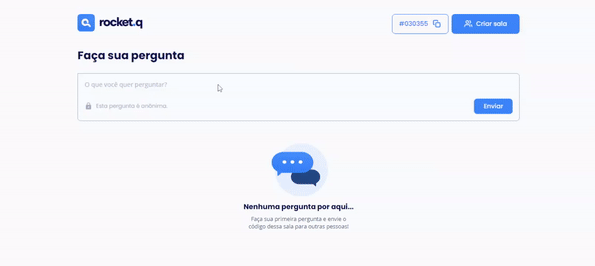

# NLW together (Discover) **rocketq**

 

  

   

  <a>
    
    
    
    
    
  <a/>

 

## Project description

Q&amp;A site developed using Node in NLW/Together (Discover)

> `<nlw/> together (Discover) rocketq` is a project developed during the **Next Level Week**, online event produced by [**Rocketseat**](https://www.rocketseat.com.br/).

## License

This project is registered under the MIT license.

---

Made with ❤️ by Renan Gabriel
